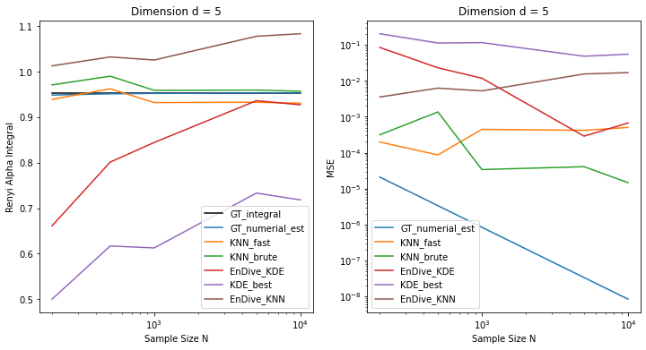

# Divergence Estimation Review

## Table of Contents

- [Literatures](#Literatures)
    - [Divergence](#Divergence)
    - [Nonparametric Divergence Estimation](#Nonparametric-Divergence-Estimation)
        - [k-NN-based Methods](#k-NN-based-Methods)
        - [KDE-based Methods](#KDE-based-Methods)
        - [Other Methods](#Other-Methods)
- [Comparison](#Comparison) 
   
## Literatures

### Divergence
- **Renyi Divergence and Kullback-Leibler Divergence**  
Tim van Erven and Peter Harremoës. _(IEEE Transactions on Information Theory 2014)_  
`#Renyi` `#KL`  
[[paper]](https://arxiv.org/abs/1202.3758) 

- **On measures of entropy and information**  
Alfréd Rényi. _(Berkeley Symposium on Mathematical Statistics and Probability 1961)_  
`#Renyi` `#KL`  
[[paper]](https://digitalassets.lib.berkeley.edu/math/ucb/text/math_s4_v1_article-27.pdf)

### Nonparametric Divergence Estimation

#### k-NN-based Methods

- **Ensemble estimation of multivariate f-divergence**  
Kevin R. Moon and Alfred O. Hero. _(IEEE International Symposium on Information Theory 2014)_   
`#knn` `#ensemble` `#f-divergence`  
[[paper]](https://arxiv.org/abs/1404.6230) 
[[myCode]](codes/Nonparametric_Divergence_Estimation.ipynb)

- **Nonparametric Divergence Estimation with Applications to Machine Learning on Distributions**  
Póczos Barnabás, Liang Xiong, and Jeff Schneider. _(UAI 2011)_  
`#knn`  `#Renyi` `#L2`  
[[paper]](https://arxiv.org/abs/1202.3758) 
[[code]](https://github.com/djsutherland/np-divs) 
[[myCode]](codes/Nonparametric_Divergence_Estimation.ipynb)

- **Divergence estimation for multidimensional densities via k-nearest-neighbor distances.**    
Qing Wang, Sanjeev R. Kulkarni, and Sergio Verdú. _(IEEE Transactions on Information Theory 2009)_  
`#knn` `#adaptive-k`    
[[paper]](https://ieeexplore.ieee.org/abstract/document/4839047?casa_token=W48--84drJwAAAAA:BFNva31utq4xq282ZgnyN29JDvjd5H6AF0ikmJx9uFW0_17S17wkpsP8kFrGvqa2f0fbyE_jjrk4)

#### KDE-based Methods
- **Ensemble estimation of information divergence**   
Kevin R. Moon, Kumar Sricharan, Kristjan Greenewald, and Alfred O. Hero. _(Entropy 2018)_   
`#kde`  `#ensemble`   
[[paper]](https://www.mdpi.com/1099-4300/20/8/560) 
[[myCode]](codes/Nonparametric_Divergence_Estimation.ipynb)

#### Other Methods
- **Estimating divergence functionals and the likelihood ratio by convex risk minimization**    
XuanLong Nguyen, Martin J. Wainwright, and Michael I. Jordan. _(IEEE Transactions on Information Theory 2010)_  
`#KL`   
[[paper]](https://arxiv.org/abs/0809.0853) 

## Comparison
TODOes
- add Time metric

